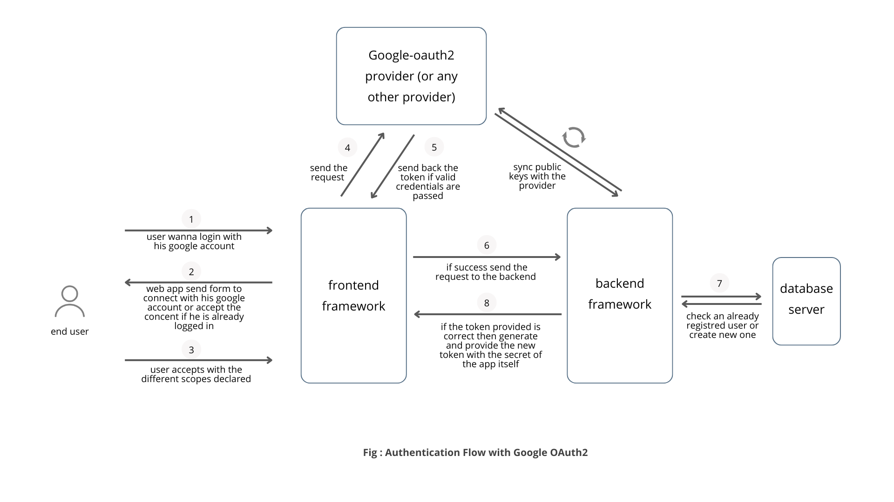

# 👋 👋 Hello Team!

Welcome to the **OAuth2 Template Repository**! This repository is designed to provide a seamless and flexible template for integrating OAuth2 authentication across various frontend and backend frameworks. Whether you're working with Angular, Next.js, Flutter, Express.js, Laravel, Spring Boot, or Flask, this template ensures that your authentication flow works flawlessly across different combinations of frontend and backend technologies.

## 🚀 Key Features

- **Flexible Integration**: Choose any frontend and backend combination, and the template will work seamlessly.
- **OAuth2 Authentication**: Secure and reliable authentication using Google OAuth2.
- **Fullstack Examples**: Includes specific fullstack examples using Next.js and Flutter with Firebase.
- **Modular Structure**: Organized folder structure for easy navigation and customization.

## 📂 Folder Structure
```
/oauth2-template
│
├── /frontend
│   ├── /angular
│   ├── /nextjs
│   └── /flutter
│
├── /backend
│   ├── /expressjs
│   ├── /laravel
│   ├── /springboot
│   └── /flask
│
└── /fullstack
    ├── /nextjs
    └── /flutter
```

## 🔄 Authentication Flow

The authentication flow in this template is designed to be straightforward and secure. Here's a high-level overview:

1. **User Login**: The user chooses to log in with their Google account.
2. **OAuth2 Consent**: The user consents to the requested scopes.
3. **Token Validation**: The backend validates the token received from Google.
4. **User Creation/Retrieval**: The backend checks if the user exists or creates a new one.
5. **JWT Generation**: A new JWT is generated and provided to the frontend.
6. **User Session Management**: The frontend manages the user session using the JWT.

![Authentication Flow with Google OAuth2]

## 🛠️ How It Works

### Home Page (`/home`)
- **Navbar**: Displays different links based on the user's authentication status.
- **Products Section**: Fetches and displays products from the backend, accessible to all users.
- **Hello Section**: Displays a personalized greeting if the user is logged in.

### Profile Page (`/profile`)
- **Authentication Required**: Only accessible to logged-in users.
- **User Data**: Fetches and displays user data from the backend.
- **Username Update**: Allows users to update their username, with backend validation.

### Login Page (`/login`)
- **OAuth2 Login**: Users can log in or register using Google OAuth2.
- **Token Handling**: The backend validates the token and manages user data.
- **JWT Issuance**: A JWT is issued upon successful authentication.

### Logout
- **Session Clearance**: Removes user credentials from cookies and redirects to the login page.

## 🧩 Fullstack Examples

### Next.js with Next-Auth
- **Frontend**: Next.js
- **Backend**: Integrated with Next-Auth for seamless authentication.

### Flutter with Firebase
- **Frontend**: Flutter
- **Backend**: Firebase for authentication and data management.

## 🚀 Getting Started

This repository provides a complete template for OAuth2 login using Google as an authentication provider. It serves as a foundation that you can extend to implement the logic of your application.

### Steps to Use This Template:

1. **Clone the Repository** (Replace with your actual repo URL).
2. **Navigate to the Frontend or Backend Directory**:
   for example
   ```bash
   cd oauth2-template/frontend/next_js
   # or
   cd oauth2-template/backend/express

3. **Install Dependencies**:
   ```bash
   npm install

4. **Start the Application**:

   ```bash
   npm start

(Commands may vary depending on the chosen framework.)

5. **Add Your Custom Logic and start building your application.**


## 🤝 Contributing

Feel free to clone, modify, and extend this template. If you'd like to add support for other frontend or backend frameworks, you’re encouraged to do so. Once you've made your changes, create a pull request to review the contributions!


Happy Coding! 🎉

